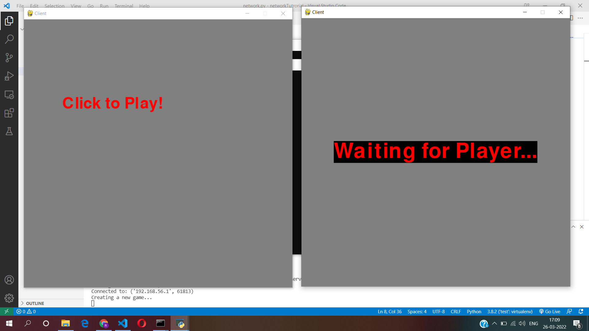
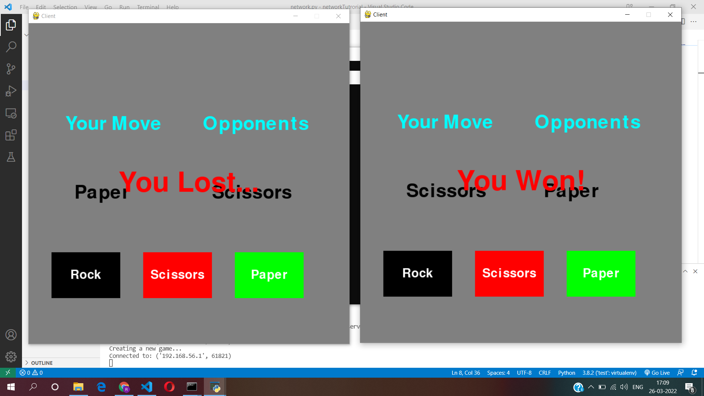
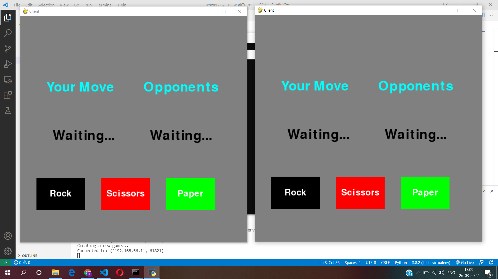

# Rock-Paper-Scissor
This project was done in a Hacathon.
    
<h2>Technologies Used:</h2>
<ul>
    <li>Python</li>
    <li>Django</li>
    <li>Socket Programming</li>
    <li>PyGame</li>
</ul>
    
<h2>Usage :</h2>
find your IP address using ipconfig/ifconfig
Change your Ip Address inside the network.py and server.py module
    python server.py

    python client.py

    python client.py

# Screenshots : 

